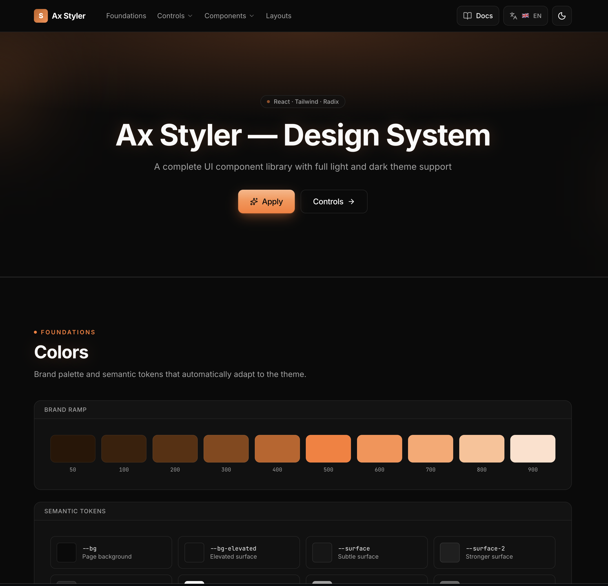

# Ax Styler — Design System

A complete UI component library and design system with full light/dark theme support. Built on React 19, TypeScript, Tailwind CSS v4 and Radix UI.



## Features

- **25+ components** — Button, Input, Select, Modal, Tabs, Pagination, DatePicker, DateRangePicker, Drawer, Tooltip, Toaster, and more.
- **Light & dark themes** — White + orange / black + orange palettes, accent `#FF6B1A` light / `#FF7A2E` dark, switched via `data-theme` on `<html>`.
- **Soft modern look** — 10–14 px radii, glassmorphism, layered shadows, brand-tinted glows on focus, hover and checked states.
- **i18n out of the box** — RU / EN / ES / DE with a built-in switcher and `{n}` interpolation.
- **Accessible** — Radix primitives, focus-visible rings, `prefers-reduced-motion` aware animations.
- **Mobile-first patterns** — Sidebar → Drawer, top-nav → Drawer, responsive tables, modals and forms.

## Stack

Vite · React 19 · TypeScript · Tailwind CSS v4 · Radix UI · react-day-picker · sonner · framer-motion · vaul · lucide-react.

## Getting started

```bash
npm install
npm run dev
```

| Script | What it does |
| --- | --- |
| `npm run dev` | Start the showcase app at `http://localhost:5173` |
| `npm run build` | Type-check and build the showcase app to `dist/` |
| `npm run build:lib` | Build the distributable library bundle to `dist-lib/` (regular + minified JS/CSS) |
| `npm run lint` | Run ESLint |
| `npm run preview` | Preview the production showcase build |

## Library bundle

`npm run build:lib` produces a drop-in bundle in `dist-lib/`:

```
ax-styler.js          ax-styler.css
ax-styler.min.js      ax-styler.min.css
```

React, ReactDOM and all peer dependencies are externalized — provide them in the host app.

## Claude skill

A Claude skill is published at `~/.claude/skills/ax-styler/` so future projects (including migrations of existing ones) can be styled to match this system. It contains the full source of every component, design tokens, install paths, a migration guide, mobile patterns and a cheatsheet.

## Project layout

```
src/
  components/
    ui/        — design-system components (Button, Input, …)
    demo/      — showcase sections
  lib/         — i18n, theme, utils
  index.css    — design tokens and global styles
skill/         — Claude skill source mirror
dist-lib/      — built library bundle (after `build:lib`)
screenshots/   — preview images
```
